# Easy to use plugin for analysing organelle position

The aim of the OrgaMapper workflow is to measure and map organelle distribution within cells with ease.
The distance of the organelles are related to the nucleus using location or signal intensity.

The image analysis plugin solves 3 core image analysis tasks:

**1. Nucleus segmentation:** The nucleus is segmented using an intensity threshold.
Nuclei at the edge of the field of view are rejected.
The generated masks are filtered for size and shape.

**2. Cell segmentation:** Cells are segmented using an intensity threshold.
Touching cells are separated using a marker controlled watershed.
The cell ROIs are filtered such that each cell contains 1 nucleus.
Cells are further filered by size and shape.

**3. Organelle detection:** We use a blob detection to detect individual organelles to locate their number and the position within the cell.

The generated masks and ROIs are then used to perform the following measurements:

1. Filtered cell ROIs:
  - Intensity of the organelle channel and an optional measurement channel.
  - Ferets diameter as well as the cell area.

2. Filtered cell ROIs & Nucleus Mask:
  - Compute euclidean distance map (EDM) from edge of nucleus masks.
  - Measure distance of each organelle detection based on EDM.
  - Extract signal value and distance of the organelle channel and an optional measurement channel.

3. Outside of unfilte1. red cell ROIs:
  - Background of the organelle channel and an optional measurement channel.

## Accepted datasets

Single multichannel .tiff files and multichannel multiseries files. We tested the workflow on multiseries .nd2 files from Nikon CSU.

For the Data analysis and plotting to work seamlessly with the image analysis we require the following naming pattern. 
 
Single .tif files: 
**\<Name\>\_\<Treatment\>\_\<Number\>**

Multiseries files: 
**\<Name\>\_\<Treatment/Wellnumber\>**

The data is expected to contain a channel with nucleus staining (DAPI) staining against cytoplasm (CMFDA) and against an organelle of choice.

## Installation

For the image analysis you need to download and install Fiji: [https://fiji.sc/](https://fiji.sc/)
The plugin is available via an update site. Add the Cellular-Imaging site:

1. Select **_Help  › Update...</strong>_** from the menu bar.
2. Click on Manage update sites. Which opens the **_Manage update sites_** dialog.
3. Press **_Add update size_** a new line in the Manage update sites dialog appears
4. Add **_https://sites.imagej.net/Cellular-Imaging/_** as url
5. Add an optional name such as Cellular-Imaging
6. Press **_Close_** and then **_Apply changes_**

For the data anaylsis you need to install R: [https://www.r-project.org/](https://www.r-project.org/) 
As an R editor I recommend to use RStudio: [https://rstudio.com/products/rstudio/download/](https://rstudio.com/products/rstudio/download/)

# Workflow execution

## Start and loading data
1. Start Fiji
2. Open OrgaMapper
    **_Fiji > Plugins > Cellular-Imaging > OrgaMapper_**
3. **_Setup dialog_** pops up

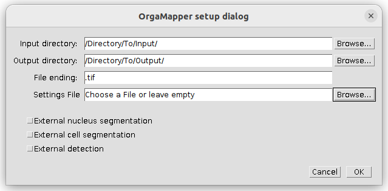

Specify the location of the input, output directories and the file ending of the files to be analyzed. If already available specify the location and name of a settings file  or otherwise leave empty. You can specify files and directory also by drag & drop into the respective field.

Press **_ok_** to continue.

## OrgaMapper Preview

OrgaMapper will search recursively in the specified input directory for files with matching file ending. The OrgaMapper preview window will open. All the available input files will be displayed in the file list (1).

The left section of the preview menu contains tabs with the different processing settings for nuclei and cell segmentation as well as organelle detection. Upon first loading of the workflow without a settings file appropriate default parameters are loaded (2).

The right section contains all key experimental settings such as pixel size and the identity of each channel (3).
The lower bar contains menu items for saving, loading and resetting the processing settings as well as the input & output directories (4).

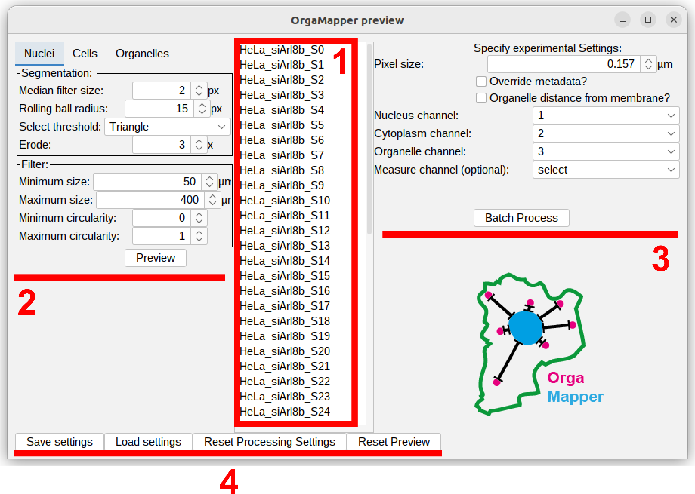

## Save, load, reset settings and reset directories

Different setting files can be saved and loaded. The reset Button will restore the processing setting to the system default. If you want to process a different dataset or store the output files in a different output directory you can press Reset Directories:

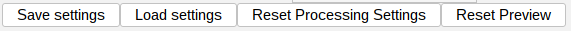

The workflow stores the experimental settings in a .xml file. This is a machine readable text file. You can open it with any text editor. The file is stored with the date and time when it has been saved: **_\<Date\>\-\<Time\>\-settings.xml_**. Each setting relevant for the processing is stored with the name of the specific setting.

## Specify experimental settings

1. *Pixel size:* the pixel size of the loaded dataset is displayed. Verify if this is correct since segmentation parameters and the units of the measurements are depending on this setting. Modify this value and click the **_override metadata_** button if necessary.

2. *Identity of the channels:* each channel is associated with a specific segmentation or measurement task. Select the correct channels for each identity. The Measurement channel is an optional setting. You can leave this on **_select_** or **_ignore_**. If you want to extract intensity measurements from another channel specify any of the other channels.
  - Nucleus channel
  - Cytoplasm channel
  - Organelle channel
  - Measure channel (Optional)

## Preview the segmentation parameters

Select a test image of the loaded image in the file list. If no file has been selected the program will prompt you to do so. In the tabs of the left section you can select the processing tasks you can optimize.

You can preview each segmentation setting on different images. In fact we want to encourage you to do so to find the optimal parameters for the entire dataset.

*TIPP:* The proposed segmentation is displayed as overlay over the image stack like any other Fiji image. So you can use any Fiji tools (zoom, pan, b/c) or can even duplicate or save the image as .tiff stack with the overlay!

In the following sections we will discuss the different processing options for each task.

### Nuclei segmentation
<table>
  <tr>
    <td>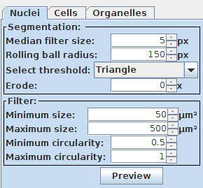</td>
    <td>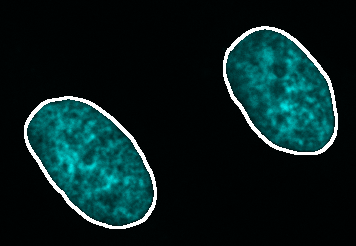</td>
  </tr>
</table>
1. Segmentation:
  - Median filter size (px) - noise reduction using the median value of the neighboring pixels. The filter size determines the size of the neighborhood.
  - Rolling ball radius (px) - radius of the rolling ball background subtraction.
  - Select threshold - global intensity based thresholding algorithm.
  - Erode (x times) - optional erosion applied to the masked generated by the thresholding.

2. Filter: you can filter the segmented nuclei using minimum and maximum size in square µm. As well as minimum and maximum circularity. This is based on Fijis Particle analyzer tool.

3. Press **_Preview_** to see the outline of the segmentation on top of the nucleus channel. Adjust the brightness contrast of the image using:
**_Image > Adjust > Brightness/Contrast...-** - **_Ctrl + Shift + C_**

### Cell segmentation
<table>
  <td>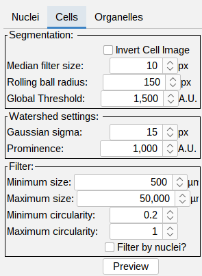</td>
  <td>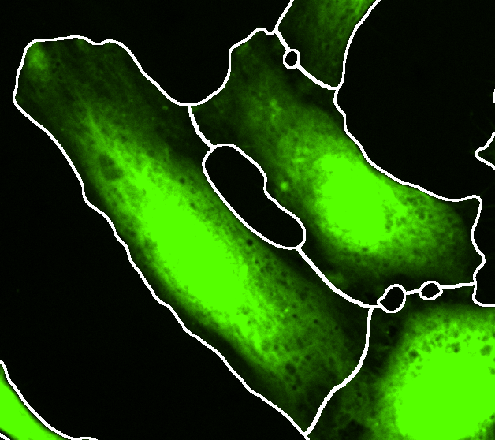</td>
</table>

1. Segmentation:
  - Median filter size (px) - noise reduction using the median value of the neighboring pixels. The filter size determines the size of the neighborhood.
  - Rolling ball radius (px) - radius of the rolling ball background subtraction.
  - Global Threshold (A.U.) - global intensity based threshold.

2. Watershed settings:
  - Gaussian sigma (px) - a large gaussian filter is applied to smooth out irregularities in the image and detect single cells.
  - Prominence (A.U.) - detection of single cells to split touching cells.

3. Filter: tick this box to toggle the visualization cell segmentations with a single nucleus. This only affects the visualization. In the final processing the cells will always be filtered for cells that have a single nucleus. Cells without or with multiple nuclei present in the cell segmentation will always be filtered!  

4. Press **_Preview_** to see the outline of the segmentation on top of the cytoplasm channel.
Adjust the brightness contrast of the image using:
**_Image > Adjust > Brightness/Contrast..._** - **_Ctrl + Shift + C_**

### Organelle detection
<table>
  <td>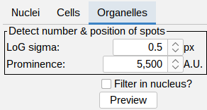</td>
  <td>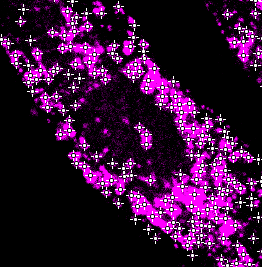</td>
</table>

1. Detect number & position of spots:
  - LoG sigma (px) - a laplacian of gaussian filter is applied to enhance blob like structures.
  - Prominence (A.U.) - detection of peaks in the filtered image.

2. Filter in nucleus: tick this box to toggle the visualization of detections in the nucleus area. This only affects the visualization. In the final processing the detections in the nucleus segmentation are always filtered.

3. Press **_Preview_** to see the outline of the segmentation on top of the organelle channel.
Adjust the brightness contrast of the image using:
**_Image > Adjust > Brightness/Contrast..._** - **_Ctrl + Shift + C_**

## Batch processing

Once you are happy with the segmentation parameters press Batch Process. The result of the workflow will be saved in the specified output directory along the used settings.

  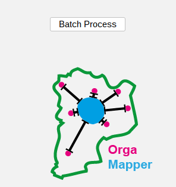

The progress of the processing will be written in the Log file. Once finished the Log file will display:

  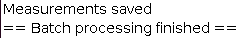

# Results & analysis

## Result images

The results of the workflow are structured the following way:

OutputFolder 
├── \<Date\>\-\<Time\>\-settings.xml 
├── cellMeasurements.csv 
├── organelleDistance.csv 
└── \<imageName\> 
&nbsp;&nbsp;&nbsp;&nbsp;&nbsp;&nbsp;&nbsp;&nbsp;├── **cellSegmentation.png** 
&nbsp;&nbsp;&nbsp;&nbsp;&nbsp;&nbsp;&nbsp;&nbsp;├── **detections.tiff** 
&nbsp;&nbsp;&nbsp;&nbsp;&nbsp;&nbsp;&nbsp;&nbsp;├── intDistance.csv 
&nbsp;&nbsp;&nbsp;&nbsp;&nbsp;&nbsp;&nbsp;&nbsp;└── **nucSegmentation.png** 

For each image a folder will be created containing visualizations for the segmentation task:

1. **cellSegmentation.png** file contains the cytoplasm channel overlaid with the nuclei segmentation and an outline of the cell segmentation.
2. **detections.tiff** file contains the organelle channel with overlays from the nuclei and cell segmentation as well as the organelle detection.
3. **nucSegmtnation.png** contains the nucleus channel with an outline of the nucleus segmentation.

## Result tables

The resulting measurements will be saved in .csv tables either collected or per individual image in case of the intensity profiles:

OutputFolder 
├── **\<Date\>\-\<Time\>\-settings.xml** 
├── **cellMeasurements.csv** 
├── **organelleDistance.csv** 
└── \<imageName\> 
&nbsp;&nbsp;&nbsp;&nbsp;&nbsp;&nbsp;&nbsp;&nbsp;├── cellSegmentation.png 
&nbsp;&nbsp;&nbsp;&nbsp;&nbsp;&nbsp;&nbsp;&nbsp;├── Detections.tiff 
&nbsp;&nbsp;&nbsp;&nbsp;&nbsp;&nbsp;&nbsp;&nbsp;├── **intDistance.csv** 
&nbsp;&nbsp;&nbsp;&nbsp;&nbsp;&nbsp;&nbsp;&nbsp;└── nucSegmentation.png 

1. **.xml settings**: will be created containing the processing settings used.
2. **cellMeasurements.csv** file contains the measurements of size, number of detections and intensity.
3. **organelleDistance.csv** contains the distance and peak intensity values for each detected organelle will be saved in the file.
4. **intDistance.csv** file contains the measurements of the intensity values of each pixel in the cytoplasm segmentation and their distance from the nucleus.
