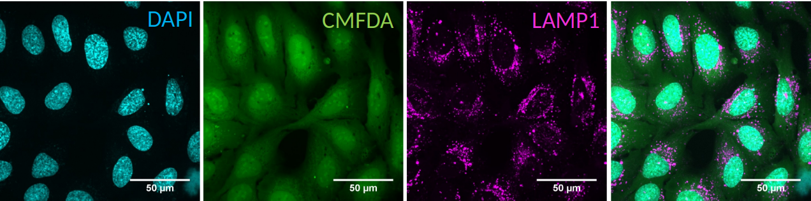

# Easy to use plugin for analysing organelle position

The aim of the OrgaMapper workflow is to measure and map organelle distribution within cells with ease. The distance of the organelles are related to the nucleus using location and signal intensity. Optionally the distance from the membrane edge can be used for distance measurements based on location and signal intensity 

## Core features of OrgaMapper

- Easy to use Java Swing based graphical user interface.
- Interactive adjustment of segmentation over entire dataset.
- Optional loading of external segmentations and/or detection.
- Batch processing executed from main interface.
- Settings are saved automatically for easy reproduction.
- Easy to use Shiny App for data analysis.

[Link to OrgaMapper repository](https://github.com/schmiedc/OrgaMapper) 
[Link to Shiny App repository](https://github.com/schmiedc/OrgaMapper_Rshiny)

## OrgaMapper at a glance

### Segmentation & Detection

The image analysis plugin solves 3 core image analysis tasks:

1. Nucleus segmentation: the nucleus is segmented using an intensity threshold.
Nuclei at the edge of the field of view are rejected.
The generated masks are filtered for size and shape.

2. Cell segmentation: cells are segmented using an intensity threshold.
Touching cells are separated using a marker controlled watershed.
The cell ROIs are filtered such that each cell contains 1 nucleus.
Cells are further filered by size and shape.

3. Organelle detection: we use a blob detection to detect individual organelles to locate their number and the position within the cell.

External segmentations and detections: Segmentations of nuclei and/or cells as well as the detection of organelles can be provided externally. 

### Measurements 

The masks and detections ROIs are then used to perform the following measurements:

1. Nucleus Mask:
  - Nucleus center of mass.

2. Filtered cell ROIs:
  - Cell area.
  - Ferets diameter.
  - Mean intensity of the organelle channel.
  - Optional: Mean intensity of the measurement channel.

3. Detections in cytoplasm, Filtered cell ROIs and Nucleus mask
  - Euclidean distance map (EDM) from edge of nucleus masks.
  - Optional: EDM from the edge of the cell mask.
  - Distance of each organelle detection based on EDM(s).
  - Signal value at the detection location in organelle channel.
  - Optional: Signal value at the detection location in measurement channel.

4. Filtered cell ROIs and Nucleus mask
  - For each pixel in the cytoplasm the distance based on the EDM(s) is extracted
  - For each pixel in the cytoplasm the signal value is measured.

5. Outside of unfiltered cell ROIs:
  - Background of the organelle channel.
  - Optional:  ackground of the measurement channel.

### Accepted datasets

Single multichannel .tiff files and multichannel multiseries files. We tested the workflow on multiseries .nd2 files from Nikon CSU.

For the Data analysis and plotting to work seamlessly with the image analysis we require the following naming pattern. 
 
Single .tif files: 
**\<Name\>\_\<Treatment\>\_\<Number\>**

Multiseries files: 
**\<Name\>\_\<Treatment/Wellnumber\>**

The data is expected to contain a channel with nucleus staining (DAPI) staining against cytoplasm (CMFDA) and against an organelle of choice.

#### External segmentations

The segmentation of the nucleus, the cell as well as the detection of the organelles can be provided externally. Segmentations can be for instance achieved by other tools such as [Labkit](https://imagej.net/plugins/labkit/), [ilastik](https://www.ilastik.org/) or [cellpose](https://www.cellpose.org/). 

The external segmentations need to be provided as grayscale .tif file. The naming pattern needs to match the corresponding orginal file in its basename and series number. A file suffix identifies the external segmentation type (cells or nuclei) or the detection.

### Installation

For the image analysis you need to download and install Fiji: [https://fiji.sc/](https://fiji.sc/)
The plugin is available via an update site. Add the Cellular-Imaging site:

1. Select **_Help  › Update..._** from the menu bar.
2. Click on Manage update sites. Which opens the **_Manage update sites_** dialog.
3. Press **_Add update size_** a new line in the Manage update sites dialog appears
4. Add **_https://sites.imagej.net/Cellular-Imaging/_** as url
5. Add an optional name such as Cellular-Imaging
6. Press **_Close_** and then **_Apply changes_**

For the data anaylsis you need to install R: [https://www.r-project.org/](https://www.r-project.org/) 
 
As an R editor use RStudio:  [https://rstudio.com/products/rstudio/download/](https://rstudio.com/products/rstudio/download/)

# Basic usage tutorials

## - [Fiji Plugin Execution](pages/workflow.html)
## - [Fiji Plugin Results](pages/results.html)
## - [Shiny App Execution](pages/rShinyApp.html)
## - [Shiny App Results](pages/analysisResults.html)

# Advanced tutorials

## - [External segmentation](pages/external_segmentation.html)
## - [Segmentation of membrane signal](pages/seg_membrane_signal.md)
## - [Analyze organelle distribution](pages/analyze_organelle_distribution.md)
