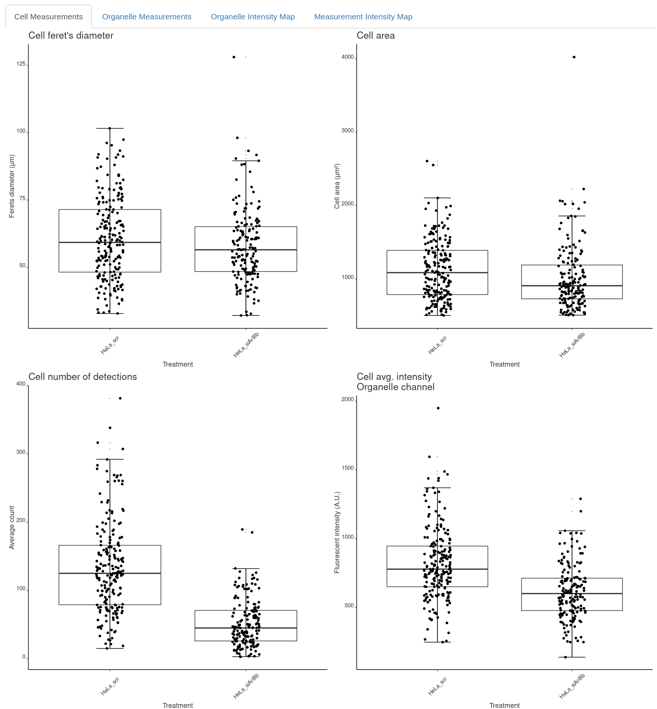
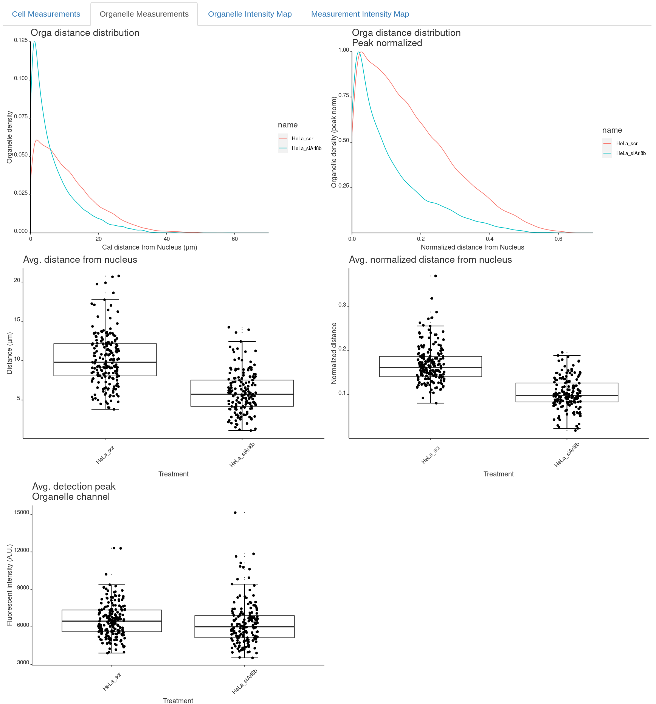
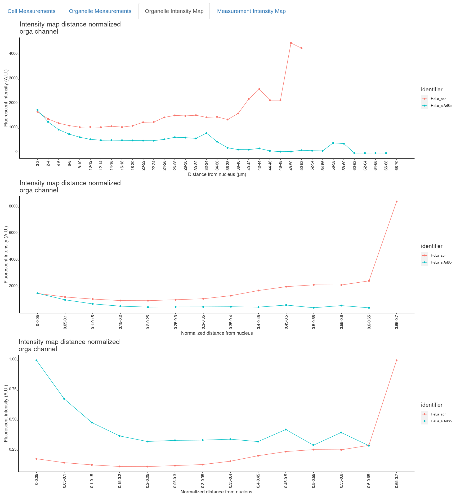

# Analysis Results

The resulting plots will be saved individually in the specified input directory under plot_distance_map and plot_intensity_map. The processed data will be saved as raw and summarized data in .xlsx files:

InputFolder 
├── \<imageName\> 
├── **plot\_distance\_map** 
├── **plot\_intensity\_map** 
├── \<Date\>\-\<Time\>\-settings.xml 
├── **\<Result name\>\_cell.xlsx** 
├── **\<Result name\>\_detection.xlsx** 
├── **\<Result name\>\_intensityProfile_Membrane.xlsx** (Optional)  
├── **\<Result name\>\_intensityProfile_Nucleus.xlsx** 
├── **\<Result name\>\_intensityRatio_Nucleus.xlsx** 
├── cellMeasurements.csv 
└── organelleDistance.csv 

## Result Files

- **\<Result name\>\_cell.xlsx**: 
Contains the summarized distance data per cell.

- **\<Result name\>\_detection.xlsx**:  
Contains the collected distance data for each individual detection for each cell.

- **\<Result name\>\_intensityProfile_Membrane.xlsx** (Optional):  
Contains the collected average intensity profile measured from the membrane for each individual image.

- **\<Result name\>\_intensityProfile_Nucleus.xlsx**:  
Contains the collected average intensity profile measured from the nucleus for each individual image.

- **\<Result name\>\_intensityRatio_Nucleus.xlsx**: 
Contains the data for computing the intensity ratio (analysis optimized for distance from nucleus).

## Overview Plots

Within the rShiny app you will then get overview plots under the tabs at the top for the different parameters.

  

First, under **Cell Measurements** you will be informed:

  

Second,you will find the organelle specific measurements under **Organelle Measurements**:

  

Finally, Organelle Intensity Map and optionally for another measurement channel you will find the intensity maps:

  

## Measured parameters

### Cell Measurements

In file **\<Result name\>\_cell.xlsx** for each image, series and cell:

 * **ferets:** Ferret’s diameter (calibrated units). 
 * **cell_area:** Cell area (calibrated units). 
 * **orga_numberOfDetections:** number of detections. 
 * **orga_intensity:** average signal in cytoplasm of organelle channel (Fluoresence A.U.). 
 * **orga_background:** average signal outside cell area in organelle channel (Fluoresence A.U.). 
 * **x_nucleus_center_mass:** x-coordinate center of mass of nucleus mask (pixels). 
 * **y_nucleus_center_mass:** y-coordinate center of mass of nucleus mask (pixels). 
 * (Optional) **measure_intensity:** average signal in cytoplasm of measurement channel (Fluoresence A.U.). 
 * (Optional) **measure_background:** average signal outside cell area in measurement channel (Fluoresence A.U.). 
 * **orga_intensity_backsub:** orga_intensity - orga_background (Fluoresence A.U.). 
 * (Optional) **measure_intensity_backsub:** measure_intensity - measure_background (Fluoresence A.U.). 
 * **orga_meanDistance_nucleus_pixel:** mean distance of organelles from nucleus (pixels). 
 * **orga_meanDistance_nucleus_calibrated:** mean distance of organelles from nucleus (calibrated units). 
 * **measure_intensityOnDetection:** signal at detection in organelle channel (Fluoresence A.U.). 
 * **orga_intensityOnDetection_backsub:** measure_intensityOnDetection - orga_background (Fluoresence A.U.). 
 * **orga_meanDistance_nucleus_normalized:** orga_meanDistance_nucleus_calibrated / ferets (calibrated units). 
 * (Optional) **orga_meanDistance_membrane_pixel:** mean distance of organelles from membrane (pixels). 
 * (Optional) **orga_meanDistance_membrane_calibrated:** mean distance of organelles from membrane (calibrated units). 
 * (Optional) **orga_meanDistance_membrane_normalized:** orga_meanDistance_membrane_calibrated / ferets (calibrated units).

### Organelle measurements

In file **\<Result name\>\_detection.xlsx** for each, image, series and cell additionally to merged in cell measurements you will find per detection: 

* **x_detection:** x-coordinate of detection (pixels). 
* **y_detection:**  y-coordinate of detection (pixels). 
* **orga_distance_nucleus_pixel:** distance of detection from nucleus (pixels). 
* **orga_distance_nucleus_calibrated:** distance of detection from nucleus (calibrated units). 
* **orga_detection_peak:** signal at detection in organelle channel (Fluoresence A.U.). 
* (Optional) **measure_detection_peak:** signal at detection in measurement channel (Fluoresence A.U.). 
* **orga_detection_peak_backsub:** orga_detection_peak - orga_background (Fluoresence A.U.). 
* (Optional) **measure_detection_peak_backsub:** measure_detection_peak - measure_background (Fluoresence A.U.). 
* **orga_distance_nucleus_normalized:** orga_distance_nucleus_calibrated / ferets (calibrated units). 
* (Optional) **orga_meanDistance_membrane_pixel:** distance of detection from membrane (pixel) 
* (Optional) **orga_meanDistance_membrane_calibrated:** distance of detection from membrane (calibrated units). 
* (Optional) **orga_meanDistance_membrane_normalized:** orga_meanDistance_membrane_calibrated / ferets (calibrated units). 

### Intensity profiles

In file **\<Result name\>\_intensityProfile_Nucleus.xlsx** the results are binned based on the binning settings specified in the rShiny App GUI. Optionally in file **\<Result name\>\_intensityProfile_Membrane.xlsx**. For each image per bin: 

* **intensityDistanceCalibrated:** distance of bin (calibrated units)
* **orga_mean:** average signal in organell channel in bin (Fluoresence A.U.).
* (Optional) **measure_mean:** average signal in measurement channel in bin (Fluoresence A.U.).

### Notes

* **Fluoresence A.U.:** fluoresence signal arbitrary units
* **(Optional):** measurements selected by the user in the OrgaMapper plugin: [Fiji Plugin Execution](workflow.html)