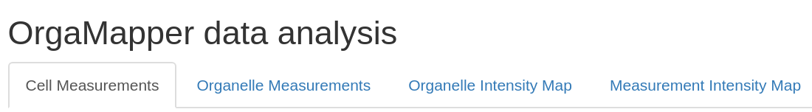

# Analysis Results

The resulting plots will be saved individually in the specified input directory under plot_distance_map and plot_intensity_map. The processed data will be saved as raw and summarized data in .xlsx files:

InputFolder 
├── \<imageName\> 
├── **plot\_distance\_map** 
├── **plot\_intensity\_map** 
├── \<Date\>\-\<Time\>\-settings.xml 
├── **\<Result name\>\_cell.xlsx** 
├── **\<Result name\>\_detection.xlsx** 
├── **\<Result name\>\_intensityProfile.xlsx** 
├── **\<Result name\>\_intensityRatio.xlsx** 
├── cellMeasurements.csv 
└── organelleDistance.csv 

## Result Files

- **\<Result name\>\_cell.xlsx**: 
Contains the summarized distance data per cell.

- **\<Result name\>\_detection.xlsx**:  
Contains the collected distance data for each individual detection for each cell.

- **\<Result name\>\_intensityProfile.xlsx**:  
Contains the collected intensity profile for each individual cell.

- **\<Result name\>\_intensityRatio.xlsx**: 
Contains the data for computing the intensity ratio.

## Overview Plots

Within the rShiny app you will then get overview plots under the tabs at the top for the different parameters.

  

First, under **Cell Measurements** you will be informed about the ferret’s diameter, area, number of detections and average intensity in the cytoplasm of the organelle channel:

  

Second,you will find the organelle specific measurements under **Organelle Measurements**:

  

Finally, Organelle Intensity Map and optionally for another measurement channel you will find the intensity maps:

  

