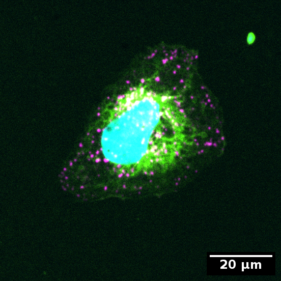
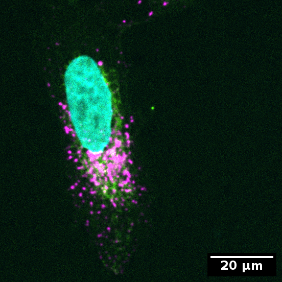

# Analysis of organelle distribution

## Example data

<!---
Link to example input data
-->


## Example data structure

Structure of data and folders:
Input<br>
├── Concentrated.tif<br>
├── Dispersed.tif<br>
└── Setting_organelle_distribution.xml<br>

Output<br>
├── Concentrated_S0<br>
&nbsp;&nbsp;&nbsp;&nbsp;&nbsp;&nbsp;&nbsp;&nbsp;├── cellSegmentation.png<br>
&nbsp;&nbsp;&nbsp;&nbsp;&nbsp;&nbsp;&nbsp;&nbsp;├── detections.tiff<br>
&nbsp;&nbsp;&nbsp;&nbsp;&nbsp;&nbsp;&nbsp;&nbsp;├── intensityDistance.csv<br>
&nbsp;&nbsp;&nbsp;&nbsp;&nbsp;&nbsp;&nbsp;&nbsp;└──  nucSegmentation.png<br>
├── Dispersed_S0<br>
&nbsp;&nbsp;&nbsp;&nbsp;&nbsp;&nbsp;&nbsp;&nbsp;├── cellSegmentation.png<br>
&nbsp;&nbsp;&nbsp;&nbsp;&nbsp;&nbsp;&nbsp;&nbsp;├── detections.tiff<br>
&nbsp;&nbsp;&nbsp;&nbsp;&nbsp;&nbsp;&nbsp;&nbsp;├── intensityDistance.csv<br>
&nbsp;&nbsp;&nbsp;&nbsp;&nbsp;&nbsp;&nbsp;&nbsp;└──  nucSegmentation.png<br>
├── 2024-03-30T091833-settings.xml<br>
├── cellMeasurements.csv<br>
└── organelleDistance.csv<br>

We also provide an R Script for the analysis of organelle distribution:
*organelle_distribution.R*

### Example input images

In the example data you will find an image with only one cell each that is exemplary for a concentrated or dispersed organelle distribution in the cell.

Example for dispersed organelles in cell: 



Example for concentrated organelles in cell: 




Color code:
* Cyan: Nucleus
* Green: Cytoplasm
* Magenta: Organelles

## Load & process example data

You can load and process the example data into OrgaMapper using the already described process in the tutorials for [Fiji Plugin Execution](workflow.html), [External segmentation](external_segmentation.html) and [Segmentation of membrane signal](seg_membrane_signal.html). 

In brief load the provided Input directory and settings file and execture the batch processing.

## Analysis of organelle distribution

Based on the provided output data we created a data analysis approach to analyze the distribution of organelles quantitatively (see below).

To use this script install the packages [tidyverse](https://www.tidyverse.org/) and [circular](https://cran.r-project.org/web/packages/circular/circular.pdf):
* Tidyverse version: 2.0.0
* Circular version: 0.5.0

In the provided R Script change the variable **directory** then execute the processing. This script takes the center of mass of the nucleus as origin and computes the arctangent (atan2) of each detection in the cell. The resulting radians of the unit circle are converted to degrees mapped to 0-360. This angular information of the organelles is converted to the coordinate system of the circular package and the circular variance is computed. 

This results in the following circular variance values of the respective cells:
* Dispersed: 0.73
* Concentrated: 0.35

The circular variance is a measure from 0-1. 0 denoting low variance (i.e. concentrated at an angle) and 1 denotes a high variance (i.e. dispersed). 

```
library(tidyverse)
library(circular)

# converts the radians of unit circle to degrees mapped to 0-360
convert_to_degrees <- function(x) {
  ifelse(x > 0, x, (2 * pi + x)) * 360 / (2 * pi)
}

directory = "Please Provide"

distance = "organelleDistance.csv"
cell_measure = "cellMeasurements.csv"

distance_path <- paste0(directory,distance)
cell_measure_path <- paste0(directory,cell_measure)

distance_file <- read.csv(distance_path, header = TRUE)
cell_measure_file <- read.csv(cell_measure_path, header = TRUE)

# extract dispersed values
dispersed_distance <- distance_file %>% filter(identifier == "dispersed")
dispersed_center_mass <- cell_measure_file %>% filter(identifier == "dispersed")

# organelle coordinates in reference frame of nucleus center mass
dispersed_distance$xDetection_CM <- dispersed_distance$xDetection - dispersed_center_mass$nucleusCenterMassX
dispersed_distance$yDetection_CM <- dispersed_distance$yDetection - dispersed_center_mass$nucleusCenterMassY

# compute atan2
dispersed_distance$detection_atan2 <- atan2(dispersed_distance$xDetection_CM, 
                                            dispersed_distance$yDetection_CM)

# converts the radians of unit circle to degrees mapped to 0-360
dispersed_distance$detection_atan2_degree <- convert_to_degrees(dispersed_distance$detection_atan2)

# converts into polar coordinates for circular computations
dispersed_polar_degrees <- as.circular(dispersed_distance$detection_atan2_degree, 
                                       units = "degrees")

# computes circular variance
circular::var(dispersed_polar_degrees, units = 'degree')

# extract dispersed values
conc_distance <- distance_file %>% filter(identifier == "concentrated")
conc_center_mass <- cell_measure_file %>% filter(identifier == "concentrated")

# organelle coordinates in reference frame of nucleus center mass
conc_distance$xDetection_CM <- conc_distance$xDetection - conc_center_mass$nucleusCenterMassX
conc_distance$yDetection_CM <- conc_distance$yDetection - conc_center_mass$nucleusCenterMassY

# compute atan2
conc_distance$detection_atan2 <- atan2(conc_distance$xDetection_CM, 
                                       conc_distance$yDetection_CM)

# converts the radians of unit circle to degrees mapped to 0-360
conc_distance$detection_atan2_degree <- convert_to_degrees(conc_distance$detection_atan2)

# converts into polar coordinates for circular computations
conc_polar_degrees <- as.circular(conc_distance$detection_atan2_degree, 
                                       units = "degrees")

# computes circular variance
circular::var(conc_polar_degrees, units = 'degree')
```