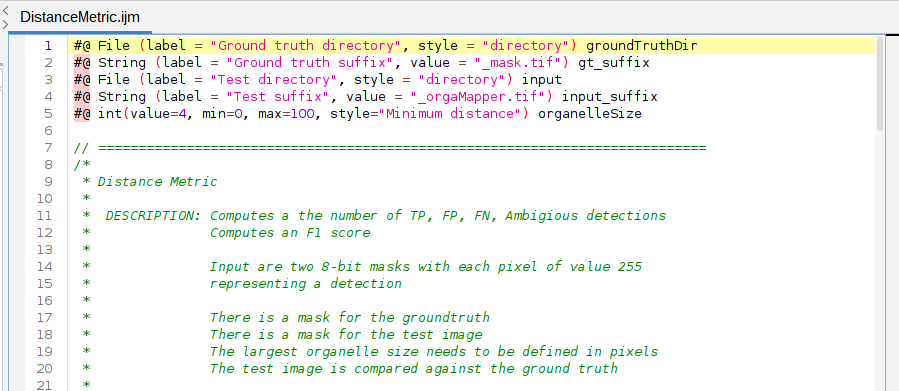
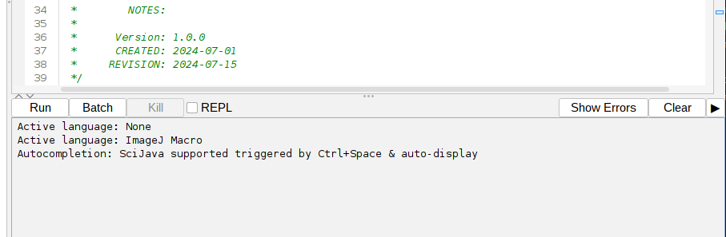
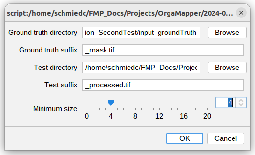
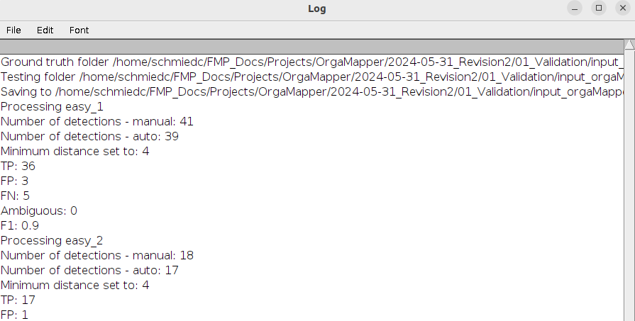
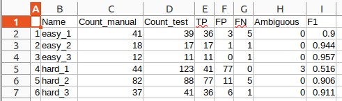
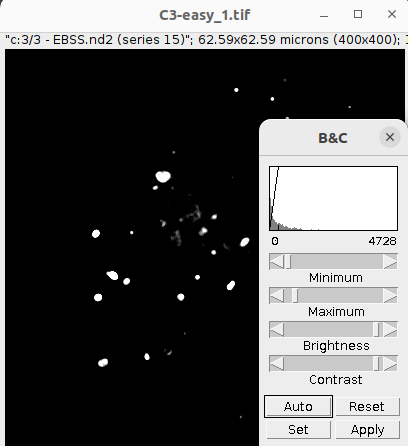
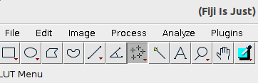
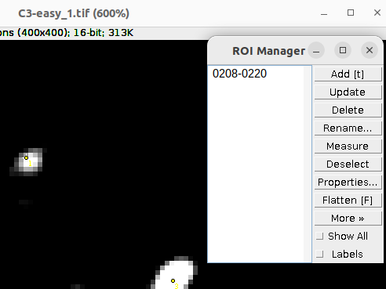
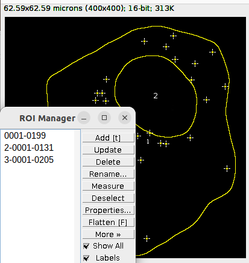
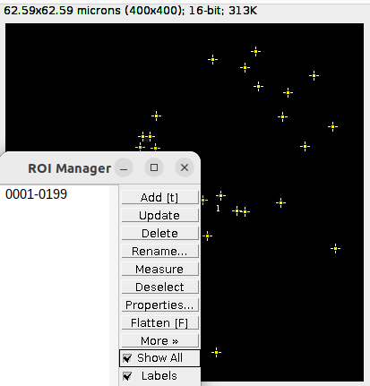

# Detection validation

This is a tutorial for a quantitative comparison of automatic detections with manual labels. We assume you are already familiar with the basic OrgaMapper workflow, otherwise please head to the basic tutorial: [Fiji Plugin Execution](workflow.html).

This example is using a Fiji Macro as the analysis tool. Head here for more information: [https://imagej.net/ij/developer/macro/macros.html](https://imagej.net/ij/developer/macro/macros.html)

## Accepted data

### Data format

Currently grayscale 8-bit .tif files are supported the input for the detections validation. The detection is supplied as a Fiji mask 8-bit .tif file in which each foreground pixel (value of 255) corresponds to a single detection.

### Data structure

The workflow requires that the manual and automatic detection data can be matched. This musts be done by providing the masks for both manual and automatic labels with a base name. The inputs can be provided via different input folders. If the same folder is used an optional suffix can be used to differentiate the manual and automatic detection masks. 

The exact External-Data-Suffix is up to the user as long as the below structure is followed. External data can be easily renamed using custom script. Below a generic example for single series input image data:

Manual_Detection_Input_Folder: 
├── BaseName-1<_Optional_Suffix>.tif 
├── BaseName-2<_Optional_Suffix>.tif 
├── BaseName-n<_Optional_Suffix> 
└── ...

Automatic_Detection_Input_Folder: 
├── BaseName-1<_Optional_Suffix>.tif 
├── BaseName-2<_Optional_Suffix>.tif 
├── BaseName-n<_Optional_Suffix> 
└── ...

### Example data
<!---
TODO: fix link
-->
You can find example data here: 

**5_TestData** 
└── 6_Detection_validation 
&nbsp;&nbsp;&nbsp;&nbsp;└── Validation 

### Example data structure

Structure of data and folders:

input_manual_detection 
├── easy_1_mask.tif 
├── easy_2_mask.tif 
├── easy_3_mask.tif 
├── hard_1_mask.tif 
├── hard_2_mask.tif 
└── hard_3_mask.tif 

input_orgaMapper 
├── easy_1_orgaMapper.tif 
├── easy_2_orgaMapper.tif 
├── easy_3_orgaMapper.tif 
├── hard_1_orgaMapper.tif 
├── hard_2_orgaMapper.tif 
└── hard_3_orgaMapper.tif 

# Apply detection validation

To analyze the success of the detection quantitatively use the provided macro tool: DistanceMetric.ijm

## Start OrgaMapper and set external input data

1. Start Fiji
2. Load the macro: Drag and drop **DistanceMetric.ijm** into Fiji

This opens the macro:

To execute the macro press: **Run** in the Macro editor:

A user interface to define the input data opens:

Specify the input folders for the manual and automatic detection. The manual detection will go into the "Ground truth directory". The automatic detections go into the "Test directroy". Also specify any suffix in the name of the provided input images.

An important setting is the minimum distance setting. As this defines the distance two detections between manual and automatic detections have to be counted as true positive. 

Press **ok** to excute the macro on the specified inputs.

## Results

The macro runs through. A log file will display the progress. The log will also be saved in the test directory (Log_<Date>.txt).

The results will be saved as a text file (Results_<Date>.txt) in the test directory:

The results contain the following outputs:

1. **Name**: The base name of the analyzed image.
2. **Count_manual**: The total number of detections in the manual detections input file.
3. **Count_test**: The total number of detections in the automatic detections input file. 
4. **TP**: True positive detections are automatic detections that match with a manual detection within the specified minimum distance. 
5. **FP**: False positive detections are automatic detections that have no match in the manual detection input. 
6. **FN**: False negative detections are detections that are present in the manual detection but absent in the automatic detection. 
7. **Ambiguous**: If multiple detections fall within the minimum distance of the manual detection these will be counted as ambiguous. 
8. **F1**: This is the F1 score calculated based on: F1 = TP / TP + 0.5 * ( FN + FP ) 

## Algorithm description

A distance metric is used to evaluate the performance of the automatic detection methods in comparison to the manually curated labels. First a distance matrix is computed by computing the pairwise distance of all points between manual and automatic segmentation using Euclidean distance: 

sqrt( ( x1 - x2)2 + ( y1- y2 )2 )

x,y: coordinates of compared points in pixels

This distance matrix image is then thresholded using a value of minimum distance provided. This value corresponds to the smallest distance between individual objects. Detections across the compared manual and automatic detection below this threshold are defined as true positive (TP). False positive (FP) detections defined as detections found only in the automatic detections and False negative (FN) detections only in the manual label. Ambigious detections (Ambiguous) are defined as multiple automatic detections within the minimum distance threshold indicating an over-detection of the method.

For a detailed explanation also look here: [https://haesleinhuepf.github.io/BioImageAnalysisNotebooks/29_algorithm_validation/validate-spot-counting.html?highlight=false+positive](https://haesleinhuepf.github.io/BioImageAnalysisNotebooks/29_algorithm_validation/validate-spot-counting.html?highlight=false+positive)

# Generate own labels

The input files can be easily generated using basic Fiji functions. 

## Manual labels

For the manual labels open the original input file that you want to generated the manual labels with. We recommend to perform this using the Gray scale LUT as information in an image is best perceived in gray scale.

**Image > Lookup Tables > Grays**

Then adjust the intensity information in the image appropriately using the Brightness/Contrast function:

**Image > Adjust > Brightness/Contrast**

Make sure you do not cut of the low intensities too much as not too lose any low intensity objects.

After you adjusted the brightness/contrast of the image select the multipoint selection tool in the Fiji tool bar:

Set a selection marker at each location of a object. Make sure the point is at the intensity peak of the object or in its center. You can then directly turn the selections into a mask by:

**Edit > Selection > Create Mask**

Save the resulting binary mask as .tiff: **File > Save As > Tiff...**. Each pixel with a value of 255 corresponds to the selection marker. 

**IMPORTANT**: Keep the basename and suffix in mind to match the automatic detection with the manual detection.

Additionally you can add the selections to the ROI Manger. This way you can save the selections and further curate them in the future. Add the selections to the ROI Manager by pressing **t** on the keyboard: 

Save the ROIs by: **ROI Manager > More > Save**

## Automatic detections with OrgaMapper

The automatic detections generated by OrgaMapper can be easily accessed and reused as they are part of the outputs of OrgaMapper: [Results of Fiji plugin](results.html). 

Open the output folder and the folder for each individual image. This contains the detection and segmentation ROIs as Overlay in the file **detections.tiff**. Add the ROIs to the ROI Manager by **Image > Overlay > To ROI Manager**. 

Delete the ROIs that contains the outline for the nucleus and the cell segmentation. These should be the ROI number 2 and 3 in the ROI Manager:

Then turn the selections of the detection ROI into a mask with **Edit > Selection > Create Mask**. Save the resulting binary mask: **File > Save As > Tiff...**. 

**IMPORTANT**: Keep the basename and suffix in mind to match the automatic detection with the manual detection.