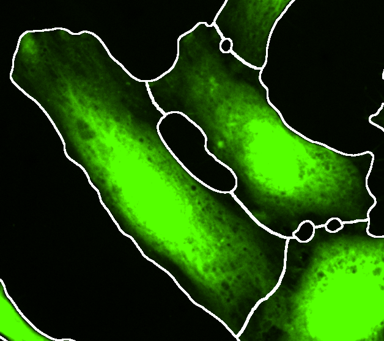
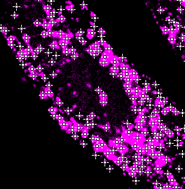
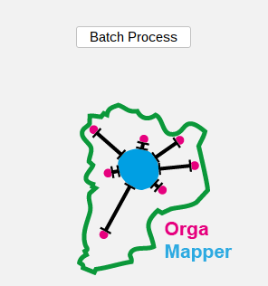

# Using external segmentations

This is a tutorial for loading external input data for the nucleus and cell segmentations as well as the organelle detection. We assume you are already familiar with the basic OrgaMapper workflow, otherwise please head to the basic tutorial: [Fiji Plugin Execution](workflow.html).

## Accepted data

### Data format
<!---
//give some examples how to get to such files from Imaris or Cell Profiler//
-->

Currently grayscale 8-bit .tif files are supported as input for external segmentations or detections. For the external segmentations each gray value denotes a specific object (e.g. individual cell or individual nucleus) and thus corresponds to an instance segmentation. The detection is supplied as a Fiji mask 8-bit .tif file in which each foreground pixel (value of 255) corresponds to a single detection. 

Further segmentation formats will be added in future work focusing on the most common usecases. 

### Data structure

The workflow requires that the external segmentation and detection data can be matched with the original input images. This musts be done by providing the external data with a base name combined with an External-Data-Suffix. All external data needs to be provided in the same folder. 

External-Data-Suffix is an identifier for any external data that consists of a base name (e.g. _NucSeg for nucleus segmentation) and the file ending (i.e. .tif) and combined must adhere to an *_External-Data.tif* format. It can also be a specific identifier for the type of external data if multiple different external data types are provided (e.g. external nucleus segmentation and organelle detection) and thus could be _NucSeg.tif and _Detect.tif. 

The exact External-Data-Suffix is up to the user as long as the below structure is followed. External data can be easily renamed using custom script. Below a generic example for single series input image data:

InputFolder: 
├── BaseName_image-1 
├── BaseName_image-2 
├── BaseName_image-n 
└── ...

ExternalSegmentation_InputFolder: 
├── BaseName_image-1**_External-Data-Suffix** 
├── BaseName_image-2**_External-Data-Suffix** 
├── BaseName_image-n**_External-Data-Suffix** 
└── ...

For multi series input image data the external files need to be matched to the base name as well es to the series number. The series number needs to be added with the suffix \<number\>. This number starts with 1. Below a generic example: 

InputFolder: 
├── BaseName_series-1 
├── BaseName_series-2 
├── BaseName_series-n 
└── ...

Each base multi series image file would contain n individual images. That number n must be matched with external input data as shown below:

ExternalSegmentation_InputFolder: 
├── BaseName_series-1**_1_External-Data-Suffix\>** 
├── BaseName_series-1**_2_External-Data-Suffix\>** 
├── BaseName_series-1**_n_External-Data-Suffix\>** 
├── ... 
├── BaseName_series-2**_1_External-Data-Suffix\>** 
├── BaseName_series-2**_2_External-Data-Suffix\>** 
├── BaseName_series-2**_n_External-Data-Suffix\>** 
├── ... 
├── BaseName_series-n**_1_External-Data-Suffix\>** 
├── BaseName_series-n**_2_External-Data-Suffix\>** 
├── BaseName_series-n**_n_External-Data-Suffix\>** 
└── ...

### Example data

<!---
Link to example input data
-->

### Example data structure

Structure of data and folders:
Input 
├── HeLa.tif 
├── HeLa_Duplicate_1.tif 
└── HeLa_Duplicate_2.tif 

Input_External_Segmentation 
├── HeLa_CellSeg.tif 
├── HeLa_NucSeg.tif 
├── HeLa_Detect.tif 
└── ... 

<!---
Update output data
-->

Output 
├── HeLa_S0 
&nbsp;&nbsp;&nbsp;&nbsp;&nbsp;&nbsp;&nbsp;&nbsp;├── cellSegmentation.png 
&nbsp;&nbsp;&nbsp;&nbsp;&nbsp;&nbsp;&nbsp;&nbsp;├── detections.tiff 
&nbsp;&nbsp;&nbsp;&nbsp;&nbsp;&nbsp;&nbsp;&nbsp;├── intensityDistance.csv 
&nbsp;&nbsp;&nbsp;&nbsp;&nbsp;&nbsp;&nbsp;&nbsp;└──  nucSegmentation.png 
├── ... 
├──  
├── cellMeasurements.csv 
└── organelleDistance.csv 

## Start OrgaMapper and set external input data
1. Start Fiji
2. Open OrgaMapper
    **_Fiji > Plugins > Cellular-Imaging > Map Organelle_**
3. **_Setup dialog_** pops up

Specify the location of the input and output directories and the file ending of the files to be analyzed. If already available, specify the location and name of a settings file or otherwise leave empty. You can specify files and directories also by drag & drop into the respective field.

For each image analysis task (i.e. nucleus segmentation, cell segmentation and organelle detection) you can select an external segmentation as input. In the above example all three possible options are selected. 

Press **_ok_** to continue.

## Load external input data

The external segmentation and detection dialog will allow you to specify the input directory for the external input data. You can also adjust the file suffix for the different segmentation options. 

*Note:* this dialog will show only the options you selected in the setup dialog.

Press **_ok_** to continue.

## Preview with external input data

The preview will open similar to the normal preview when using the internal OrgaMapper segmentations and detection. The only difference is that the internal segmentation options in the left side of the preview are hidden for each external segmentation option you selected. 

To use the segmentation and detection preview please select an image in the file list and head to the different settings tab on the left. 

You will still be able to select for each image analysis task an example file and visualize the external segmentation. For image analysis tasks were you did not select an external segmentation the usual settings dialog will still be shown. For a tutorial that shows how to operate the internal OrgaMapper segmentation please look here: [Fiji Plugin Execution](workflow.html).

### External nucleus segmentation
 
Select the nuclei external segmentation at the **Nuclei** tab and press **Preview** to visualize the external segmentation on the matching original data. Adjust the brightness contrast of the image using:
**_Image > Adjust > Brightness/Contrast..._** - **_Ctrl + Shift + C_**

<table>
  <tr>
    <td></td>
    <td></td>
  </tr>
</table>

### External cell segmentation 

Select the cells external segmentation at the **Cells** tab and press **Preview** to visualize the external segmentation on the matching original data. Adjust the brightness contrast of the image using:
**_Image > Adjust > Brightness/Contrast..._** - **_Ctrl + Shift + C_**

<table>
  <td></td>
  <td></td>
</table>

**IMPORTANT:** For the background measurement the area outside of the provided cell segmentation will be used. The true image background (offset from the camera) can only be assessed if this area is devoid of any signal. Make sure this condition is still true in the provided cell segmentation or do not use the background subtraction. 

### External organelle detection

Select the organelle external detection at the **Organelles** tab and press **Preview** to visualize the external detection on the matching original data. Adjust the brightness contrast of the image using:
**_Image > Adjust > Brightness/Contrast..._** - **_Ctrl + Shift + C_** 

<table>
  <td></td>
  <td></td>
</table>

## Batch Processing

The batch processing can then be executed the same way as the workflow using the internal segmentation. The result of the workflow will be saved in the specified output directory along the used settings.

  

The progress of the processing will be written in the Log file. Once finished, the Log file will display:

  

## Results

For a documentation of the image analysis results have a look at the [Fiji Plugin Results](results.html).

The results can be processed using an RShiny workflow: [Shiny App Execution](rShinyApp.html).
