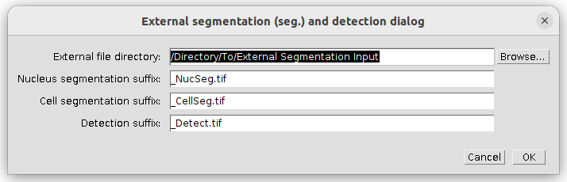
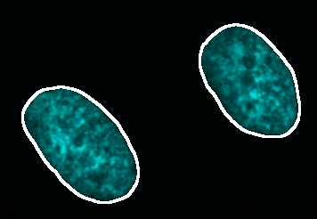
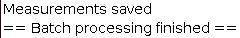

# Using external segmentations

This is a tutorial for loading external input data for the nucleus and cell segmentations as well as the organelle detection. We assume you are already familiar with the basic OrgaMapper workflow, otherwise please head to the basic tutorial: [Fiji Plugin Execution](workflow.html).

## Accepted data

<!---
TODO: Describe input data
-->

## Start OrgaMapper and set external input data
1. Start Fiji
2. Open OrgaMapper
    **_Fiji > Plugins > Cellular-Imaging > Map Organelle_**
3. **_Setup dialog_** pops up

Specify the location of the input, output directories and the file ending of the files to be analyzed. If already available specify the location and name of a settings file  or otherwise leave empty. You can specify files and directory also by drag & drop into the respective field.

For each image analysis task (i.e. nucleus, cell segmentation and organelle detection) you can select an external segmentation as input. Here shown for all possible options. 

Press **_ok_** to continue.

## Load external input data

The external segmentation and detection dialog will allow you to specify the input directory for the external input data. Also you can adjust the file suffix for the different segmentation options. 

*Note:* this dialog will show only the options you selected in the setup dialog.

Press **_ok_** to continue.

## Preview with external input data

The Preview will open similar to the normal preview using the internal segmentations and detection. The only difference is that the internal segmentation options in the left side of the preview are hidden for each external segmentation option you selected. 

To use the segmentation and detection preview please select an image in the file list and head to the different settings tab on the left. 

You will still be able to select for each image analysis task an example file and visualize the external segmentation. For image analysis tasks were you did not select an external segmentation the usual settings dialog will still be shown. For a tutorial that shows how to operate the interal segmentation please look here: [Fiji Plugin Execution](workflow.html).

### External nucleus segmentation
 
Select the nuclei external segmentation at the **Nuclei** tab and press **Preview** to visualize the external segmentation on the matching original data. Adjust the brightness contrast of the image using:
**_Image > Adjust > Brightness/Contrast..._** - **_Ctrl + Shift + C_**

<table>
  <tr>
    <td></td>
    <td></td>
  </tr>
</table>

### External cell segmentation 

Select the cells external segmentation at the **Cells** tab and press **Preview** to visualize the external segmentation on the matching original data. Adjust the brightness contrast of the image using:
**_Image > Adjust > Brightness/Contrast..._** - **_Ctrl + Shift + C_**

<table>
  <td></td>
  <td></td>
</table>

**IMPORTANT:** for the background measurement the area outside of the provided cell segmentation will be used. The true image background (offset from the camera) can only be assessed if this area is devoid of any signal. Make sure this condition is still true in the provided cell segmentation or do not use the background subtraction. 

### External organelle detection

Select the organelle external detection at the **Organelles** tab and press **Preview** to visualize the external detection on the matching original data. Adjust the brightness contrast of the image using:
**_Image > Adjust > Brightness/Contrast..._** - **_Ctrl + Shift + C_** 

<table>
  <td></td>
  <td></td>
</table>

## Batch Processing

The batch processing can then be execute the same way as the workflow using the internal segmentation. The result of the workflow will be saved in the specified output directory along the used settings.

  

The progress of the processing will be written in the Log file. Once finished the Log file will display:

  

## Results

For a documentation of the image analysis results have a look at the [Fiji Plugin Results](results.html).

The results can be processed using an RShiny workflow: [Shiny App Execution](rShinyApp.html).
