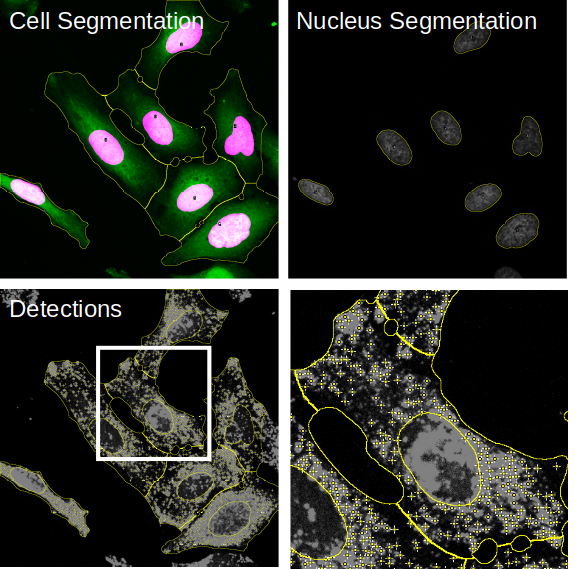

# Results of Fiji plugin

This is a documentation of the image analysis results. To understand how to process these results have a look at the [Shiny App Execution](rShinyApp.html).

## Result images

The results of the workflow are structured the following way:

OutputFolder 
├── \<Date\>\-\<Time\>\-settings.xml 
├── cellMeasurements.csv 
├── organelleDistance.csv 
├── organelleDistanceFromMembrane.csv (Optional) 
└── \<imageName\> 
&nbsp;&nbsp;&nbsp;&nbsp;&nbsp;&nbsp;&nbsp;&nbsp;├── **cellSegmentation.png** 
&nbsp;&nbsp;&nbsp;&nbsp;&nbsp;&nbsp;&nbsp;&nbsp;├── **detections.tiff** 
&nbsp;&nbsp;&nbsp;&nbsp;&nbsp;&nbsp;&nbsp;&nbsp;├── intDistance.csv 
&nbsp;&nbsp;&nbsp;&nbsp;&nbsp;&nbsp;&nbsp;&nbsp;├── intensityDistanceFromMembrane.csv (Optional) 
&nbsp;&nbsp;&nbsp;&nbsp;&nbsp;&nbsp;&nbsp;&nbsp;└── **nucSegmentation.png** 

For each image a folder will be created containing visualizations for the segmentation task:

1. **cellSegmentation.png**: file contains the cytoplasm channel overlaid with the nuclei segmentation and an outline of the cell segmentation.
2. **detections.tiff**: file contains the organelle channel with overlays from the nuclei and cell segmentation as well as the organelle detection.
3. **nucSegmtnation.png**: contains the nucleus channel with an outline of the nucleus segmentation.

  

## Result tables

The resulting measurements will be saved in .csv tables either collected or per individual image in case of the intensity profiles:

OutputFolder 
├── **\<Date\>\-\<Time\>\-settings.xml** 
├── **cellMeasurements.csv** 
├── **organelleDistance.csv** 
├── **organelleDistanceFromMembrane.csv** (Optional) 
└── \<imageName\> 
&nbsp;&nbsp;&nbsp;&nbsp;&nbsp;&nbsp;&nbsp;&nbsp;├── cellSegmentation.png 
&nbsp;&nbsp;&nbsp;&nbsp;&nbsp;&nbsp;&nbsp;&nbsp;├── Detections.tiff 
&nbsp;&nbsp;&nbsp;&nbsp;&nbsp;&nbsp;&nbsp;&nbsp;├── **intDistance.csv** 
&nbsp;&nbsp;&nbsp;&nbsp;&nbsp;&nbsp;&nbsp;&nbsp;├── **intensityDistanceFromMembrane.csv** (Optional) 
&nbsp;&nbsp;&nbsp;&nbsp;&nbsp;&nbsp;&nbsp;&nbsp;└── nucSegmentation.png 

1. **.xml settings**: will be created containing the processing settings used.
2. **cellMeasurements.csv**: file contains the measurements of size, number of detections, mean intensities and center of mass of nucleus.
3. **organelleDistance.csv**: contains the distance from the nucleus edge and peak intensity values for each detected organelle.
4. **organelleDistanceFromMembrane.csv** (Optional): contains the distance from the cell edge as well as the peak intensity values for each detected organelle.
5. **intDistance.csv**: file contains the measurements of the intensity values of each pixel in the cytoplasm segmentation and their distance from the nucleus.
5. **intensityDistanceFromMembrane.csv**: file contains the measurements of the intensity values of each pixel in the cytoplasm segmentation and their distance from the cell edge.
