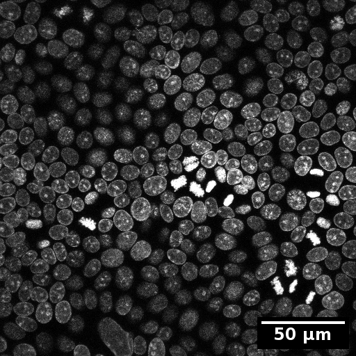
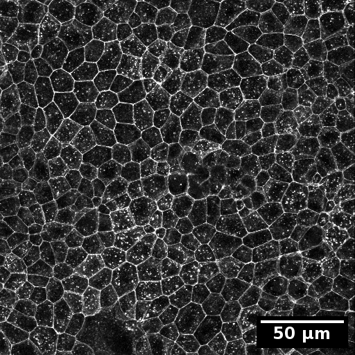
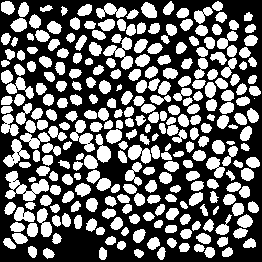
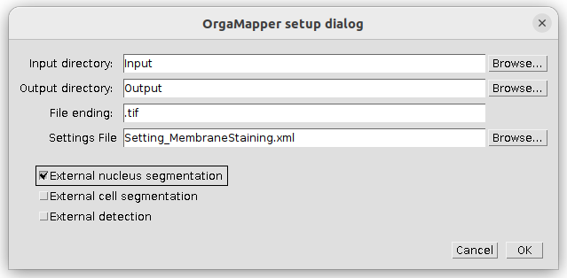
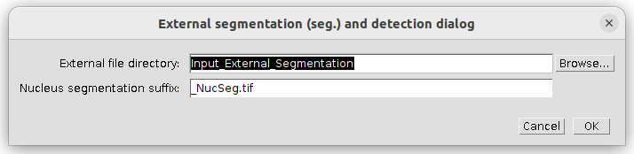
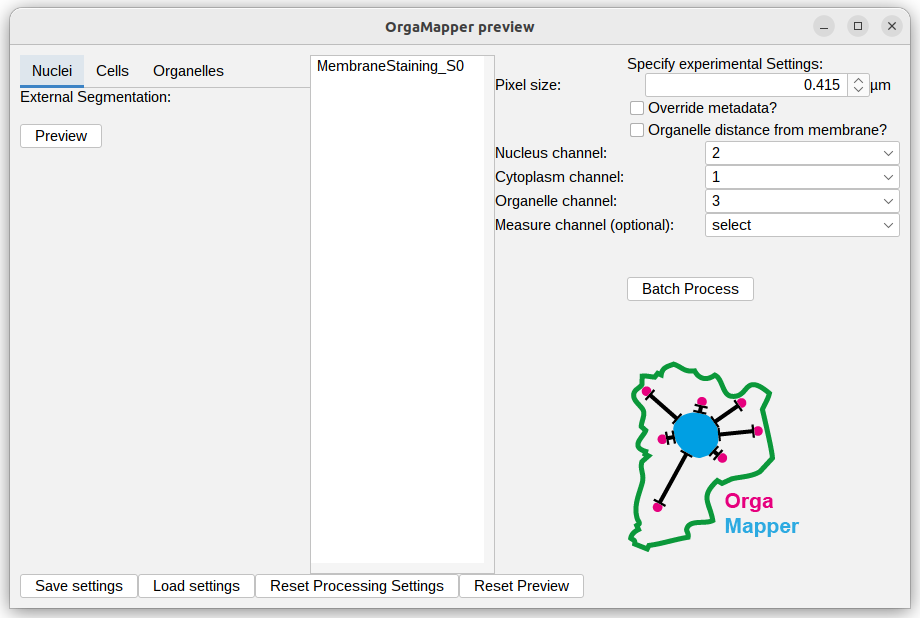
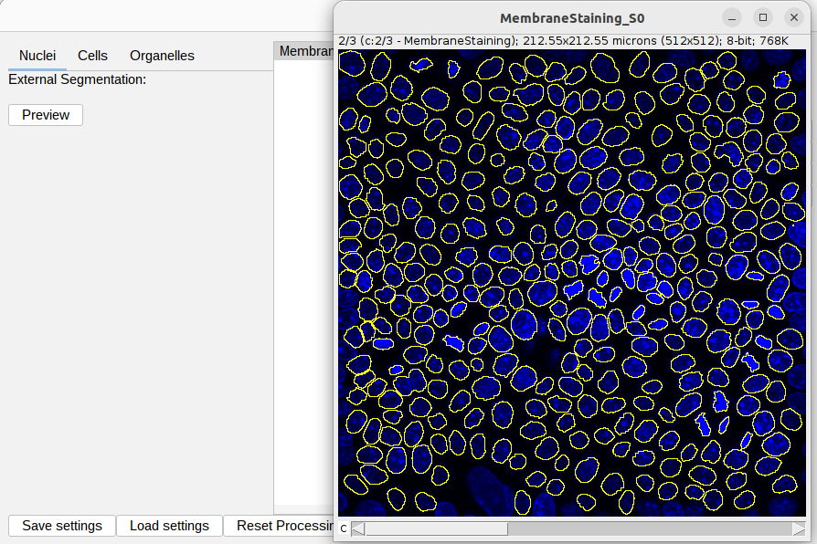
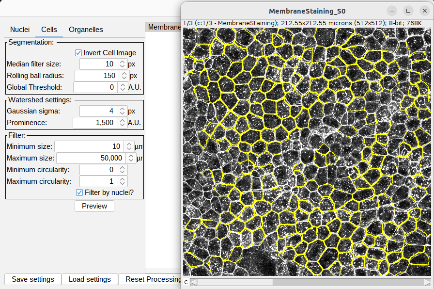

# Single cell segmentation using a plasma membrane signal

## Example data

<!---
Link to example input data
-->

### Example data structure

Structure of data and folders:
Input 
├── MembraneStaining.tif 
└── Setting_MembraneStaining.xml 

Input_External_Segmentation 
└── MembraneStaining_NucSeg.tif 

Output 
├── MembraneStaining_S0 
&nbsp;&nbsp;&nbsp;&nbsp;&nbsp;&nbsp;&nbsp;&nbsp;├── cellSegmentation.png 
&nbsp;&nbsp;&nbsp;&nbsp;&nbsp;&nbsp;&nbsp;&nbsp;├── detections.tiff 
&nbsp;&nbsp;&nbsp;&nbsp;&nbsp;&nbsp;&nbsp;&nbsp;├── intensityDistance.csv 
&nbsp;&nbsp;&nbsp;&nbsp;&nbsp;&nbsp;&nbsp;&nbsp;└──  nucSegmentation.png 
├── 2024-04-03T120353-settings.xml 
├── cellMeasurements.csv 
└── organelleDistance.csv 

### Example input images

The test data for this tutorial contains a nucleus stain as well as a membrane staining. To simulate the organelle channel for the organelle detection the membrane staining was duplicated.

<table>
  <tr>
    <td></td>
    <td></td>
  </tr>
</table>

The segmentation of the nuclei via the internal OrgaMapper intensity-based segmentation was difficult. Therefore an external segmentation is provided. This segmentation has been generated by manually curating a segmentation generated via [Labkit](https://imagej.net/plugins/labkit/). 

Steps to generate this segmentation:
1. Pixel classification using Labkit.
2. Saved segmentation result as .tif.
3. Convert to ImageJ/Fiji mask (Threshold; 8-bit; Background: 0, Foreground: 255).
4. Binary operation: close holes and erode.
5. Load adjusted segmentation as labeling in Labkit.
6. Manual curation of segmentation using Labkit.
7. Nuclei at the edges of the field of view excluded. 
8. Saved labeling as .tif
9. Convert to ImageJ/Fiji mask (Threshold; 8-bit; Background: 0, Foreground: 255).

## Load example data

1. Start Fiji
2. Open OrgaMapper
    **_Fiji > Plugins > Cellular-Imaging > Map Organelle_**
3. **_Setup dialog_** pops up

Specify the location of the input and the output directories. The file ending is .tif. Select the provided settings file and tick the external nucleus segmentation as external data input: 

Press **_ok_** to continue.

The external data setup dialog pops up. Specify the input directory for the external nucleus segmentation. The Nucleus segmentation suffix should work as is:

Press **_ok_** to continue.

## Processing example data

The Preview based on the provided data and settings file should pop up:

The provided settings should work as is. You can check the previews for external nucleus segmentation:

The provided settings should give rise to the cell segmentation as shown below. *Note:* that the **Invert Cell Image** setting is selected:

You can the execute the batch processing via pressing **Batch Process**.

  

